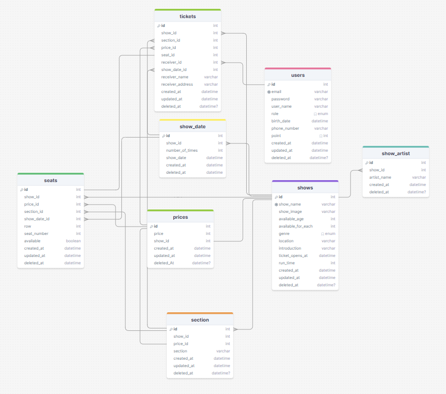
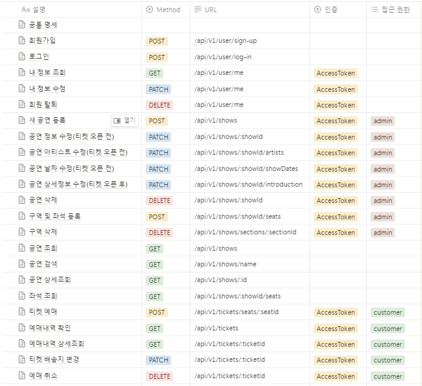
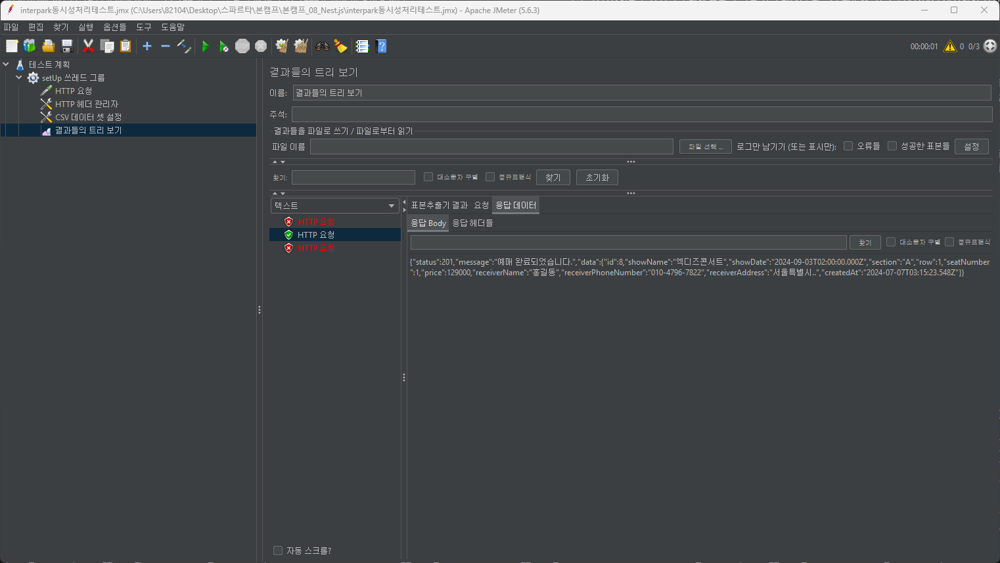

# 티켓 예매 사이트
## 배포 주소
주소 여기 적자...

## 기술
<h3 align="center">🍋 BackEnd 🍋</h3>
<div align="center">


</div>

<h3 align="center">🍋 Tools 🍋</h3>
<div align="center">


</div>

## ERD

https://drawsql.app/teams/own-64/diagrams/ticket/embed


## API 명세서

https://taropie313.notion.site/Nest-js-API-0a291e9e70894744b760f5f6e559213f?pvs=4

## 프로젝트 설치 및 실행 방법
### Setting
#### 1. 코드 불러오기
```
git clone https://github.com/lemonpie313/spartaNodejs07-tickets.git .
```

#### 2. 패키지 설치
```
npm install
```

#### 3. .env 파일 생성
```
DB_HOST="사용할 RDS 엔드포인트"
DB_PORT=사용할 RDS 포트(3306)
DB_USERNAME="사용할 RDS의 계정이름"
DB_PASSWORD="사용할 RDS의 비밀번호"
DB_NAME="사용할 RDS DB 이름"
DB_SYNC=true
JWT_ACCESS_SECRET_KEY="jwt 토큰 시크릿 키(임의 지정)"
```

### 서버 실행
```
npm start
```

## 고민했던 점, 문제 해결
실제 티켓 예매 사이트의 디테일들을 최대한 따라해보고자 하였고, 그 과정에서 기능의 구현 방법에 대해 고민을 많이 하였다.

### 1. 좌석 생성
같은 공연장이라도 공연의 무대에 따라 구역별 좌석 배치가 다르기 때문에, 좌석을 사용자가 지정하여 생성할 수 있도록 구현하고자 하였다. 좌석 배치는 달라도 좌석 번호를 매기는 방법은 ```구역```, ```행```, ```열```로 동일하기 때문에, 행과 열의 범위를 받고, 제외할 좌석을 받아 행, 열에 따라 좌석 정보를 생성할 수 있도록 하였다.

### 2. 티켓 예매 시 회원정보 사용 여부
인터파크의 경우, 수령자 정보를 입력받을 때, 본인인증을 위해 생년월일도 같이 입력받는다. 이번 프로젝트에서도 인터파크와 마찬가지로 티켓 예매시 생년월일을 받아 회원정보와 일치하는지 여부를 확인할 수 있도록 하였다.


### 3. 티켓 예매 시 회원정보 사용 여부
티켓 예매 시 수령자 정보를 회원정보 그대로 입력받을지 여부를 useUserInfo 변수로 받고, 해당 값이 false일 때에만 수령자 정보를 필수로 받도록 하고자 하였다. 그러나 class-validator에서 하나의 값에 따라 나머지 값들을 다르게 검증하는 기능은 제공하지 않았다.

따라서, ```optionalByBoolean.constraint.ts``` 파일에 useUserInfo의 boolean값에 따라 나머지 값들을 검증하는 custom-validator를 직접 작성하여 dto에 적용하였다.

### 4. 예매 시 동시성 처리
여러 클라이언트가 하나의 자리를 예매하려고 할 때, 나중에 들어온 요청에 대해서는 예매 처리를 해서는 안된다. 따라서, 좌석 예매를 완료했을 경우 seat 테이블의 available 컬럼을 false로 변경시키는 과정을 트랜잭션에 추가하였고, 각각의 트랜잭션은 커밋 된 데이터만 읽을 수 있도록 isolation level을 read committed로 설정하여 트랜잭션을 구성하였다.
다음은 JMeter로 예매 기능의 동시성 테스트를 한 결과이다. 세개의 요청 중 하나의 요청에 대해서만 예매가 완료되었다.

